# 👋 Hello, I'm Auwanga!

  

## 🚀 About Me

I'm a passionate developer who loves creating innovative solutions and exploring new technologies. My journey in tech has been driven by curiosity and the desire to build things that make a difference.

- 🔭 Currently working on **exciting web development projects**
- 🌱 Learning **React, Node.js, and Cloud Technologies**
- 👯 Looking to collaborate on **open source projects**
- 💬 Ask me about **JavaScript, Python, Web Development**
- 📫 Reach me at **auwanga@enkaliprime.com**
- ⚡ Fun fact: **I love solving coding puzzles and building side projects!**

---

  <h2>🚀 <strong>Building Real-World Impact</strong></h2>
  
<em>Where Code Meets Global Challenges</em>

---

## 🧠 **What I Actually Build** *(Beyond Tutorials)*

  

> 💡 **I focus on real-world systems**, especially for environments with limited connectivity

<table>
  <tr>
    <td align="center" width="50%">
      <h3>🌍 <strong>Offline-First AI</strong></h3>
      
• No internet dependency • No API key requirements • Works everywhere

    </td>
    <td align="center" width="50%">
      <h3>🤖 <strong>AI Agents</strong></h3>
      
• Intent recognition • Contextual understanding • Smart automation

    </td>
  </tr>
  <tr>
    <td align="center" width="50%">
      <h3>🗣️ <strong>Language Translation</strong></h3>
      
• Namibian languages ↔ English • Real-time processing • Cultural preservation

    </td>
    <td align="center" width="50%">
      <h3>📡 <strong>Edge AI</strong></h3>
      
• Raspberry Pi deployment • Local server architecture • Resource optimization

    </td>
  </tr>
</table>

  

> ⚡ **If it doesn't work offline, it isn't finished.**

---

## 🏗️ **Flagship Platform**

  <h2>🌐 <strong>EnkaliPrime</strong></h2>
  
<em>AI-Powered Education & Communication Platform for Africa</em>

  
  

### 🎯 **Core Features**

| Feature | Description | Impact |
|---------|-------------|---------|
| 🤖 **AI Chatbots** | Offline & online intelligent assistants | 24/7 student support |
| 🌐 **Translation** | Real-time local language processing | Breaking language barriers |
| 🎓 **Career Guidance** | AI-powered career recommendations | Future-ready education |
| 🤝 **Collaboration** | School-to-school resource sharing | Community building |
| ⚙️ **Developer APIs** | SDKs, CLI tools & integrations | Ecosystem growth |

  <h3>📍 <strong>Real-World Deployment</strong></h3>
  
🗺️ <strong>Piloted in schools across the Omaheke Region, Namibia</strong>

  

---

## 🧪 **Offline AI Architecture** *(Core Innovation)*

```mermaid
graph TD
    A[📱 Mobile App<br/>React Native] -->|Wi-Fi| B[🖥️ Local AI Server<br/>Raspberry Pi]
    B -->|Inference| C[🧠 Local LLMs<br/>LLaMA / DeepSeek]

    style A fill:#e1f5fe
    style B fill:#f3e5f5
    style C fill:#e8f5e8
```

  <h3>🏗️ <strong>Distributed Intelligence Framework</strong></h3>

  <table>
    <tr>
      <td align="center">
        <h4>🔌 <strong>Fully Offline</strong></h4>
        
Zero internet dependency No cloud costs Works anywhere

      </td>
      <td align="center">
        <h4>⚡ <strong>Low-Resource Optimized</strong></h4>
        
Raspberry Pi compatible Minimal power consumption Scalable architecture

      </td>
      <td align="center">
        <h4>📈 <strong>Prototype → Production</strong></h4>
        
Start small, scale big Modular design Future-proof

      </td>
    </tr>
  </table>

---

## 🏆 **Recognition & Impact**

  <h2>🌟 <strong>Achievements That Matter</strong></h2>

### 🏅 **Competition Victories**
| 🏆 Achievement | Organization | Year |
|----------------|--------------|------|
| 🥇 **National Winner** | BOOST UP Pitch Competition (NCRST) | 2024 |
| 🥈 **UNDP 2nd Place** | International Competition | 2024 |
| 🏅 **MTC Best Presentation** | Education Category | 2024 |
| 🏆 **National Winner** | ICT Summit | 2023 |

### 🌍 **Global Leadership**

  
  

### 💰 **Funding & Resources**

  <h3>💎 <strong>$9,281.90 USD Raised</strong></h3>
  
<em>for AI research & equipment at age 17</em>

  

---

## 🧩 **Tech Stack** *(Reality vs. Resume)*

  <h2>🛠️ <strong>Daily Driver Technologies</strong></h2>
  
<em>What actually powers my work</em>

### 🤖 **AI & Machine Learning**

  
  
  
   
  
  

### 🎨 **Frontend Development**

  
  
  
  

### ⚙️ **Backend & Infrastructure**

  
  
  
  

---

## 🧠 **Engineering Philosophy**

  <h2>🎯 <strong>Core Principles</strong></h2>

| Principle | Meaning | Why It Matters |
|-----------|---------|----------------|
| 🚀 **Execution > Ideas** | Build now, perfect later | Real impact beats perfect plans |
| 📦 **Ship Early, Improve Fast** | Launch, iterate, scale | Learning through doing |
| 🌍 **Access Beats Perfection** | Working solution > Perfect code | Technology should serve people |
| 🔌 **Offline Is Not Optional** | Works without internet | Global accessibility |

---

## 📌 **What's Next** *(Current Explorations)*

  <h3>🔬 <strong>Building the Future</strong></h3>

### 🤖 **Advanced AI**
- **Agent Workflows**: Multi-step AI reasoning chains
- **Intent Processing**: Understanding context & goals
- **Autonomous Systems**: Self-improving AI agents

### 📄 **Document Intelligence**
- **PDF Processing**: Auto-fill & data extraction
- **Form Reasoning**: Intelligent document understanding
- **Smart Automation**: Paperwork elimination

### 🛠️ **Developer Platforms**
- **SDK Design**: Easy-to-use development tools
- **API Ecosystems**: Connected developer experiences
- **CLI Tools**: Powerful command-line interfaces

### ⚡ **Edge Computing**
- **Hardware Optimization**: Maximizing AI on edge devices
- **Power Efficiency**: Low-energy AI processing
- **Distributed Intelligence**: Networked edge systems

---

## 🤝 **Open To Collaborate**

  <h2>🌟 <strong>Let's Build Together</strong></h2>

| Collaboration Type | Focus Areas | Impact Goal |
|-------------------|-------------|-------------|
| 🔬 **Research** | AI for development, offline systems | Scientific advancement |
| 💻 **Open Source** | Edge AI, education technology | Community benefit |
| 🌍 **Youth Programs** | Global tech initiatives | Next generation |
| 🏗️ **Systems Building** | Real-world solutions | Measurable impact |

  

---

## 🛠️ Tech Stack

### Languages

### Frameworks & Libraries

### Tools & Platforms

## 🌟 Featured Projects

### 🚀 [enkali prime AI](https://github.com/Auwanga/enkaliprime_AI)
Offline AI Chat-Bot using modern web technologies for intelligent conversations.

**Tech Stack:** TypeScript, AI/ML, Web Technologies

### 🎯 [Chatbot UI](https://github.com/Auwanga/chatbot-ui)
AI chat interface for every model, providing a seamless user experience.

**Tech Stack:** TypeScript, React, AI Integration

### 💻 [Gemini Chatbot](https://github.com/Auwanga/gemini-chatbot)
Build your own generative UI chatbot using Vercel AI SDK and Google Gemini.

**Tech Stack:** Next.js, Google Gemini, Vercel AI SDK

## 🔗 Connect With Me

  
  
  
  

## 🎯 Current Focus

- 🔨 Building **scalable web applications**
- 📚 Learning **advanced React patterns and state management**
- 🎨 Exploring **UI/UX design principles**
- 🤝 Contributing to **open source projects**

## 📈 Activity Graph

  

## 🏆 GitHub Achievements

  

---

  
   
  <em>Thanks for visiting my profile! Have a great day! 😊</em>

---

> Building technology that works where it matters most.

⭐ **Star this repo if you found it interesting!**
🎉 **Feel free to fork and customize it for your own profile!**
